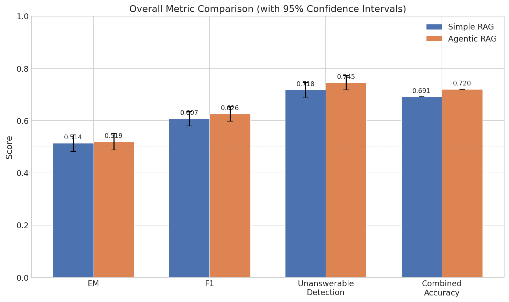
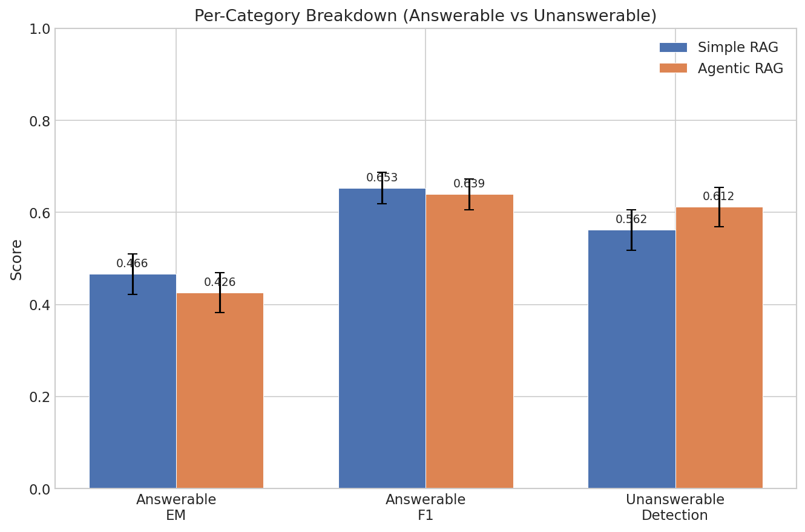
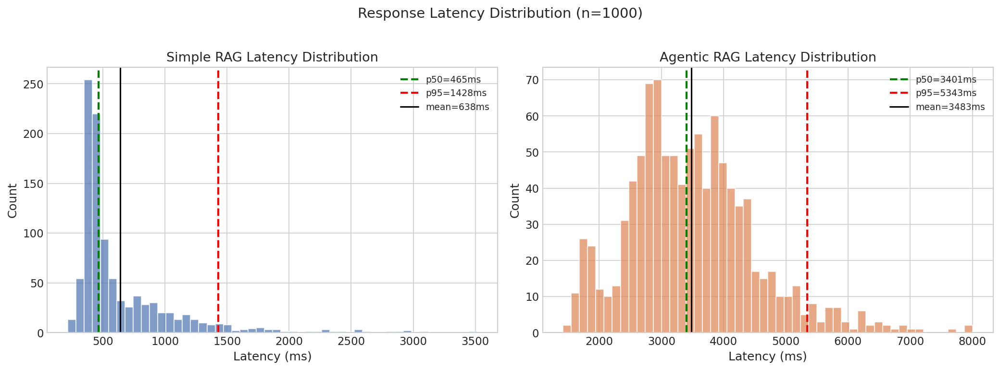
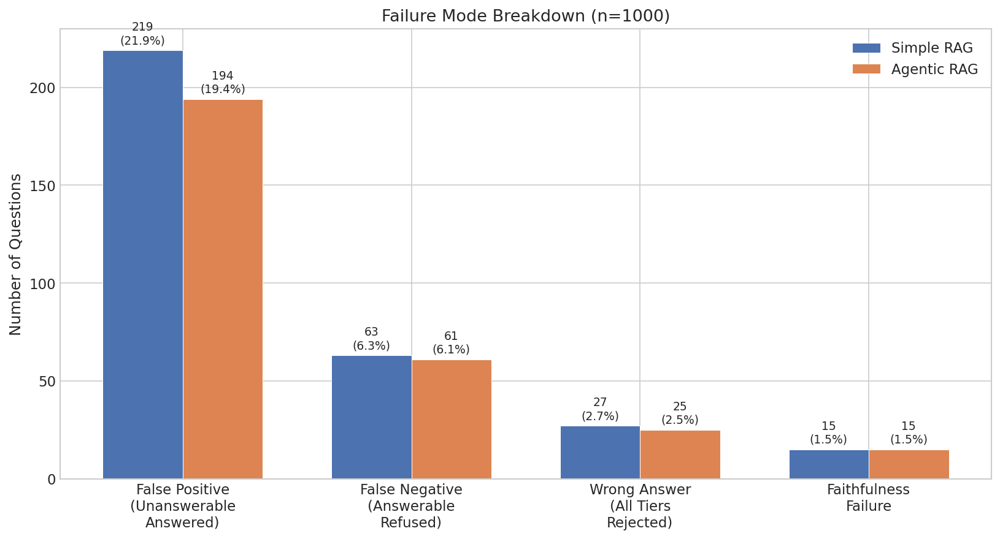

# Agent Benchmarking: Simple RAG vs Agentic RAG

> **Rigorous empirical comparison** of two RAG architectures on **SQuAD v2.0** (1,000 questions) — fully local, no proprietary APIs, with a 3-tier evaluation cascade, statistical significance testing, and structured failure analysis.

---

## Key Results

| Metric | Simple RAG | Agentic RAG | Winner |
|--------|-----------|-------------|--------|
| Combined Accuracy | 69.1% | **72.0%** | Agentic (+2.9pp) |
| Unanswerable Detection | 56.2% | **61.2%**\* | Agentic (+5.0pp) |
| Answerable EM | **46.6%** | 38.0% | Simple (+8.6pp) |
| Mean Latency | **638ms** | 3,483ms | Simple (5.46x faster) |
| Tokens / Query | **1,060** | 3,725 | Simple (3.51x cheaper) |

\*Statistically significant — 95% confidence intervals are non-overlapping.

---

## System Architecture

```
┌──────────────────────────────────────────────────────────────────────┐
│                         run_benchmark.py                             │
│                  CLI Entry Point — orchestrates all phases           │
└────────┬──────────────┬──────────────┬──────────────────────────────┘
         │              │              │
    --mode run     --mode eval    --mode compare
         │              │              │
         ▼              ▼              ▼
  ┌─────────────┐ ┌──────────┐ ┌─────────────┐
  │   Runner    │ │Evaluator │ │  Comparator │
  │ (pipeline/) │ │(pipeline/)│ │ (pipeline/) │
  └──────┬──────┘ └────┬─────┘ └──────┬──────┘
         │              │              │
         ▼              │              ▼
  ┌──────────────────────────┐   ┌────────────────┐
  │        Two Agents        │   │ 95% Confidence │
  │                          │   │   Intervals    │
  │  ┌───────────────────┐   │   │ (t-distribution│
  │  │   Simple RAG      │   │   │  per metric)   │
  │  │  ─────────────    │   │   └────────────────┘
  │  │  Retrieve (BM25)  │   │
  │  │  → Single LLM     │   │         ▼
  │  │    call           │   │   ┌────────────────┐
  │  └───────────────────┘   │   │ 3-Tier Cascade │
  │                          │   │ Evaluation     │
  │  ┌───────────────────┐   │   │                │
  │  │   Agentic RAG     │   │   │ Tier 1: EM/F1  │
  │  │  ─────────────    │   │   │ Tier 2: Sem.   │
  │  │  Tool 1: Retrieve │   │   │   Similarity   │
  │  │  Tool 2: Assess   │   │   │ Tier 3: LLM    │
  │  │  Tool 3: Rewrite  │   │   │   Judge (blind)│
  │  │  Tool 4: Check    │   │   └────────────────┘
  │  │    Answerability  │   │
  │  │  Tool 5: Generate │   │
  │  └───────────────────┘   │
  └──────────────────────────┘
         │
         ▼
  ┌─────────────────────────────────────────┐
  │           Shared Resources              │
  │  BM25 Retriever │ Qwen3-14B (vLLM)     │
  │  BGE-large-en-v1.5 Embeddings          │
  └─────────────────────────────────────────┘
```

**→ Full architecture details: [ARCHITECTURE.md](ARCHITECTURE.md)**

---

## Guardrails & Safety Mechanisms

The benchmark implements multiple safety mechanisms to ensure evaluation integrity:

| Guardrail | Description | Where |
|-----------|-------------|--------|
| **Blind LLM Judge** | Judge prompt contains **no agent identifier** — prevents bias | `src/evaluation/llm_judge.py` |
| **Unanswerable Detection** | Agents must refuse to answer questions with no supporting context | Both agents |
| **3-Tier Cascade** | Each tier only adds credit, never removes — monotone guarantee | `src/evaluation/evaluator.py` |
| **Semantic Threshold** | Cosine similarity ≥ 0.85 required for tier-2 credit | `src/evaluation/semantic_similarity.py` |
| **Statistical Gating** | Results only claimed significant when 95% CIs are non-overlapping | `src/pipeline/compare.py` |
| **Shared Retriever** | Both agents use identical BM25 index — isolates agent logic as the sole variable | `src/retrieval/bm25_retriever.py` |
| **Crash-safe writes** | Predictions flushed to JSONL after each question — safe to resume | `src/pipeline/runner.py` |

---

## Project Structure

```
agent-benchmarking/
├── src/
│   ├── data/          # SQuAD v2 loader, schema (PredictionResult)
│   ├── retrieval/     # BM25 + embedding retrievers, hit_rate/MRR metrics
│   ├── agents/        # Simple RAG, Agentic RAG, LLM client, 5 tools
│   ├── evaluation/    # EM/F1, semantic similarity, LLM judge
│   ├── pipeline/      # Runner, evaluator, comparator (95% CIs)
│   └── analysis/      # 11 charts, failure analysis, summary reports
├── configs/           # YAML: base.yaml, experiment.yaml, per-agent
├── evaluation/        # Results JSON, predictions JSONL, comparison JSON
├── reports/
│   ├── figures/       # 11 PNG charts (metric comparison, distributions, etc.)
│   ├── BENCHMARK_REPORT.md
│   ├── failure_analysis.md
│   └── analysis_summary.md
├── demo/              # FastAPI web demo — side-by-side agent comparison along with video link
├── run_benchmark.py   # Main CLI entry point
└── ARCHITECTURE.md    # Deep-dive architecture documentation
```

---

## Setup Instructions

**Prerequisites:** Python 3.11, NVIDIA GPU with 30+ GB VRAM (tested on A100 80GB)

### Step 1 — Create environment

```bash
conda create --prefix ./env python=3.11 -y
conda activate ./env
```

### Step 2 — Install dependencies

```bash
pip install vllm datasets sentence-transformers rank-bm25 openai \
    numpy pandas matplotlib seaborn pyyaml tqdm scipy scikit-learn \
    fastapi uvicorn aiohttp
```

### Step 3 — Start the LLM server

```bash
python -m vllm.entrypoints.openai.api_server \
    --model Qwen/Qwen3-14B \
    --port 8000 \
    --gpu-memory-utilization 0.9 \
    --max-model-len 8192
```

> The embedding model (`BAAI/bge-large-en-v1.5`) downloads automatically on first run via `sentence-transformers`.

---

## Usage

```bash
# Full pipeline: run both agents → evaluate → compare
python run_benchmark.py --mode all

# Run individual steps
python run_benchmark.py --mode run --agents simple_rag
python run_benchmark.py --mode run --agents agentic_rag
python run_benchmark.py --mode evaluate
python run_benchmark.py --mode compare

# Generate all 11 visualization charts + failure analysis reports
python -m src.analysis.run_analysis

# Launch interactive demo web app (no vLLM server needed)
python demo/app.py
# → Opens at http://localhost:8501
```

---

## Demo

The demo app (`demo/app.py`) loads pre-computed results and lets you:
- Browse all 1,000 questions side-by-side
- Filter by category (answerable / unanswerable) and outcome
- Inspect per-question reasoning traces, tier credits, and LLM judge verdicts

> **Demo video:** See [`demo/`](demo/) folder — recording demonstrates normal flow and failure cases (false positives, wrong answers, unanswerable detection).

---

## Evaluation Design

### 3-Tier Cascade

```
Question + Predicted Answer
         │
         ▼
┌────────────────────────┐
│  Tier 1: EM / F1       │  EM=1 or F1 ≥ 0.5 → CORRECT (tier1)
│  (string matching)     │
└──────────┬─────────────┘
           │ NO
           ▼
┌────────────────────────┐
│  Tier 2: Semantic Sim  │  cosine(pred, gold) ≥ 0.85 → CORRECT (tier2)
│  (BGE-large-en-v1.5)   │
└──────────┬─────────────┘
           │ NO
           ▼
┌────────────────────────┐
│  Tier 3: LLM Judge     │  Qwen3-14B judges → CORRECT (tier3)
│  (blind, no agent ID)  │
└──────────┬─────────────┘
           │ NO
           ▼
        INCORRECT
```

**Invariant:** `EM_accuracy ≤ semantic_accuracy ≤ combined_accuracy`

### Failure Modes Identified

| Category | Simple RAG | Agentic RAG |
|----------|-----------|-------------|
| A: False Positive (hallucinated answer) | 219 | 194 |
| B: False Negative (refused answerable) | 63 | 80 |
| C: Wrong Answer (all tiers rejected) | varies | varies |
| D: Faithfulness failures | tracked | tracked |

See [`reports/failure_analysis.md`](reports/failure_analysis.md) for examples.

---

## Tech Stack

| Component | Technology |
|-----------|-----------|
| LLM | Qwen3-14B via vLLM (fully local) |
| Embeddings | BAAI/bge-large-en-v1.5 |
| Retrieval | BM25 (rank-bm25) |
| Evaluation | 3-tier cascade (EM/F1 → Semantic → LLM Judge) |
| Statistics | 95% CI via scipy t-distribution |
| Dataset | SQuAD v2.0 — 1,000 questions (500 answerable, 500 unanswerable) |
| Demo | FastAPI + HTML/JS |

---

## Sample Charts

| Metric Comparison | Category Breakdown |
|---|---|
|  |  |

| Latency Distribution | Failure Modes |
|---|---|
|  |  |

---

## Documentation

| File | Contents |
|------|----------|
| [ARCHITECTURE.md](ARCHITECTURE.md) | Agent architectures, evaluation design, pipeline flow, config system |
| [reports/BENCHMARK_REPORT.md](reports/BENCHMARK_REPORT.md) | Full benchmark report with results, statistical analysis, trade-offs |
| [reports/analysis_summary.md](reports/analysis_summary.md) | Strengths, weaknesses, failure mode narratives |
| [reports/failure_analysis.md](reports/failure_analysis.md) | Per-category failure breakdown with question examples |

---

## License

See [LICENSE](LICENSE) file.
