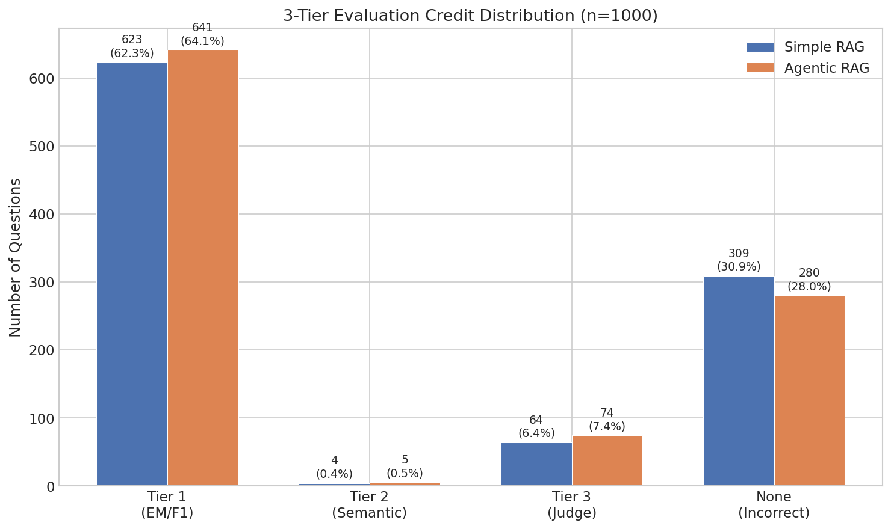
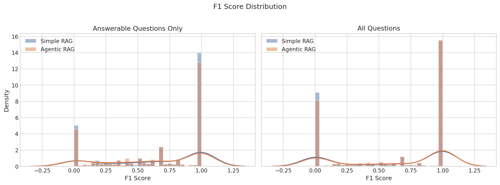
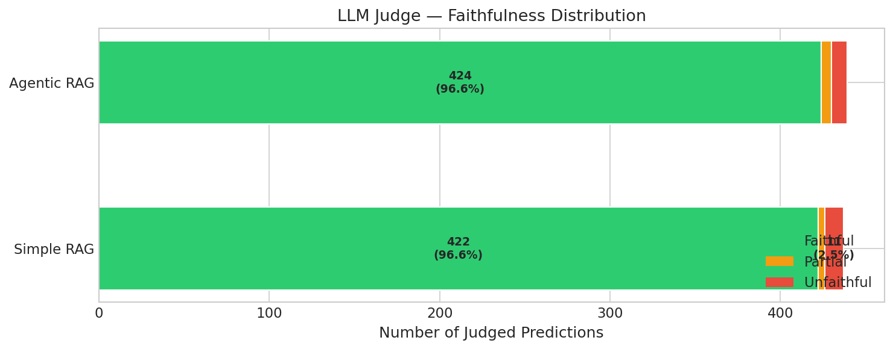
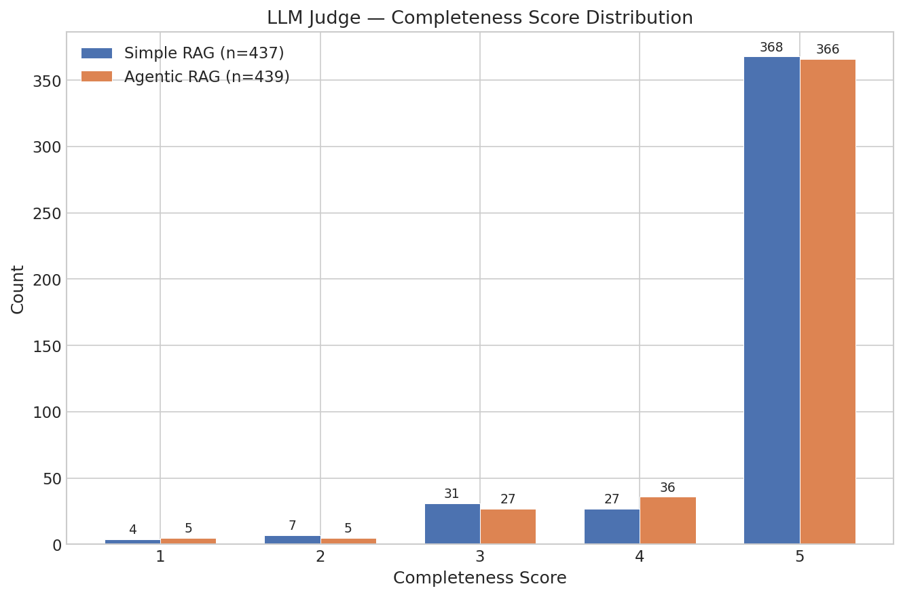
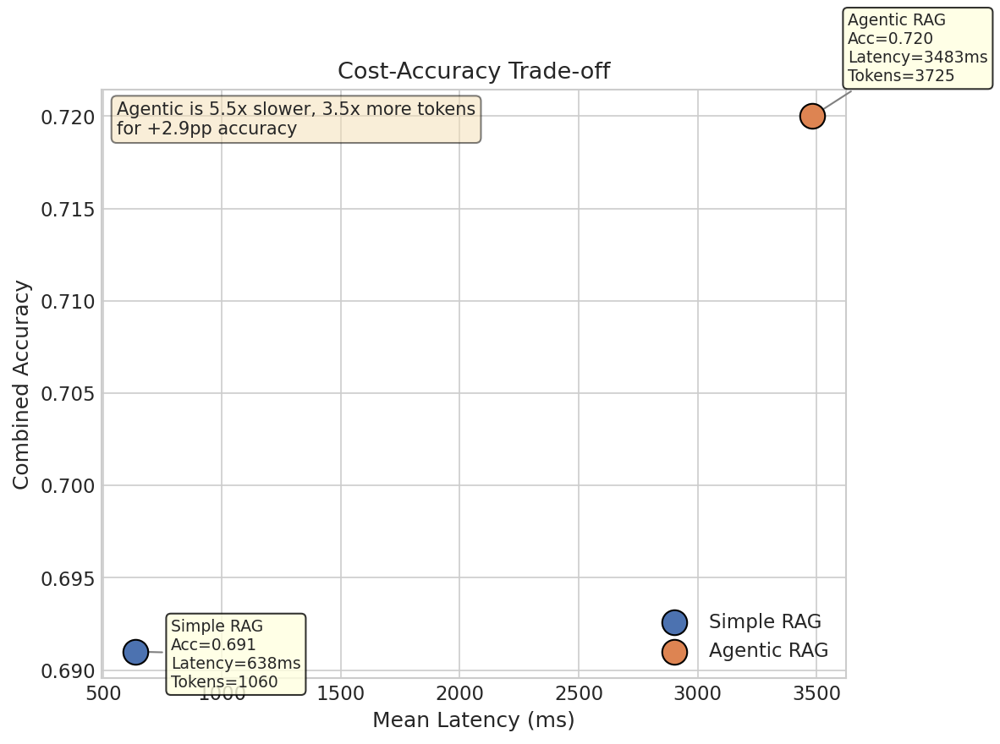
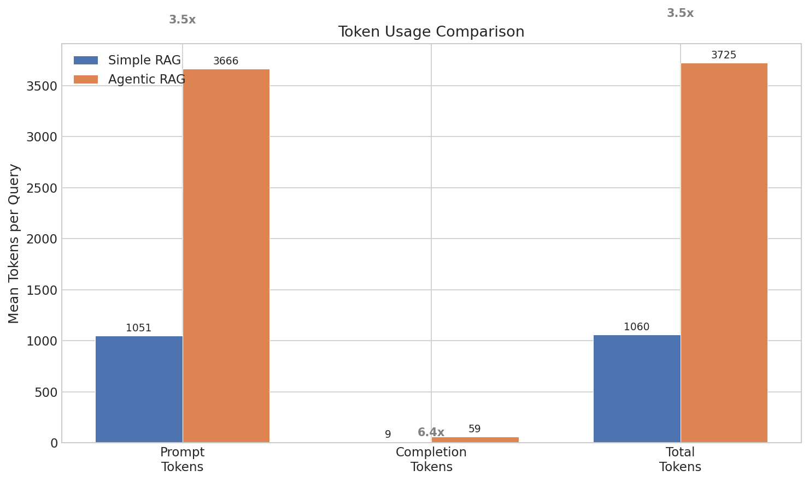
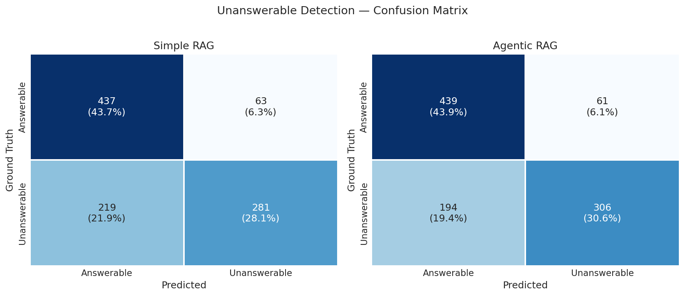

# Benchmark Report: Simple RAG vs Agentic RAG

## 1. Experiment Setup

### Task
Benchmark two RAG agent architectures — Simple RAG (single-pass) and Agentic RAG (multi-step with tools) — on a large-scale question answering task to produce a rigorous evaluation report.

### Dataset
- **Source**: SQuAD v2.0 (Stanford Question Answering Dataset), validation split
- **Size**: 1,000 questions (500 answerable, 500 unanswerable)
- **Sampling**: Seed=42, 50/50 answerable ratio, stratified
- **Challenge**: SQuAD v2 includes adversarial unanswerable questions with misleading premises — the context contains related information but not the answer

### Model
- **LLM**: Qwen3-14B served via vLLM (temperature=0, max_tokens=512)
- **Embeddings**: BAAI/bge-large-en-v1.5 (for Tier 2 semantic similarity)
- **Retriever**: BM25 (rank-bm25), top_k=5, indexed on 695 unique contexts

### Evaluation Consistency
Both agents were evaluated under **identical conditions**:
- Same 1,000 questions in the same order
- Same BM25 retriever instance (indexed once, shared)
- Same LLM client and judge model
- Agent-agnostic evaluator — single codepath, no branching by agent type
- Blind LLM judge — no agent identifier in prompts
- Same thresholds: semantic similarity cutoff (0.85), F1 partial threshold (0.5)
- Deterministic seeding (seed=42) throughout

---

## 2. Metrics

### Quantitative Metrics (Tier 1)
- **Exact Match (EM)**: Normalized string comparison against gold answers (lowercased, articles/punctuation stripped)
- **Token F1**: Token-level precision/recall/F1 against best gold answer
- **Unanswerable Accuracy**: Binary — did the agent correctly identify unanswerable questions?

### Semantic Similarity (Tier 2)
- **Method**: Cosine similarity between BGE-large embeddings of predicted and gold answers
- **Threshold**: 0.85 — predictions above this are considered semantically correct
- **Purpose**: Catches paraphrased answers that Tier 1 misses (e.g., "O2" ≈ "oxygen")

### LLM-as-Judge (Tier 3)
- **Correctness**: Is the answer factually correct? (0 or 1)
- **Completeness**: Does it cover all aspects of the gold answer? (1-5 scale)
- **Faithfulness**: Is the answer grounded in the provided context? (faithful / partial / unfaithful)

### Combined Accuracy (3-Tier Cascade)
A question is correct if **any** tier credits it:
1. Tier 1: EM=1 or F1 ≥ 0.5 → correct
2. Tier 2: Semantic similarity ≥ 0.85 → correct (only if Tier 1 failed)
3. Tier 3: Judge correctness = 1 → correct (only if Tiers 1-2 failed)

**Invariant**: `EM_accuracy ≤ semantic_accuracy ≤ combined_accuracy`

### Cost Metrics
- **Latency**: End-to-end response time (ms) per question
- **Token Usage**: Prompt tokens, completion tokens, total tokens per question

---

## 3. Results

### 3.1 Overall Performance

| Metric | Simple RAG | 95% CI | Agentic RAG | 95% CI | Delta |
|--------|-----------|--------|-------------|--------|-------|
| Exact Match | 0.514 | [0.483, 0.545] | 0.519 | [0.488, 0.550] | +0.5pp |
| Token F1 | 0.607 | [0.580, 0.635] | 0.626 | [0.599, 0.653] | +1.9pp |
| Unanswerable Acc. | 0.718 | [0.690, 0.746] | 0.745 | [0.718, 0.772] | +2.7pp |
| Combined Accuracy | 0.691 | — | 0.720 | — | +2.9pp |


### 3.2 Per-Category Breakdown

**Answerable Questions (n=500)**

| Metric | Simple RAG | 95% CI | Agentic RAG | 95% CI | Delta |
|--------|-----------|--------|-------------|--------|-------|
| EM | 0.466 | [0.422, 0.510] | 0.426 | [0.383, 0.470] | **-4.0pp** |
| F1 | 0.653 | [0.619, 0.687] | 0.640 | [0.606, 0.673] | -1.4pp |

**Unanswerable Questions (n=500)**

| Metric | Simple RAG | 95% CI | Agentic RAG | 95% CI | Delta |
|--------|-----------|--------|-------------|--------|-------|
| Detection Rate | 0.562 | [0.518, 0.606] | 0.612 | [0.569, 0.655] | **+5.0pp** |

Key finding: Agentic RAG's advantage comes entirely from better unanswerable detection (+5.0pp, **statistically significant** — CIs do not overlap). On answerable questions, Simple RAG is actually better (-4.0pp EM).


### 3.3 Tier Distribution

| Tier | Simple RAG | % | Agentic RAG | % |
|------|-----------|---|-------------|---|
| Tier 1 (EM/F1) | 623 | 62.3% | 641 | 64.1% |
| Tier 2 (Semantic) | 4 | 0.4% | 5 | 0.5% |
| Tier 3 (Judge) | 64 | 6.4% | 74 | 7.4% |
| None (Incorrect) | 309 | 30.9% | 280 | 28.0% |

Tier 2 contributes minimally (4-5 questions) because SQuAD answers are typically short extractive spans — semantic paraphrasing is rare. Tier 3 rescues 64-74 additional questions that string matching and embeddings miss.



### 3.4 Score Distributions



Both agents show a bimodal F1 distribution on answerable questions — a cluster near 0 (wrong answers) and a cluster near 1 (correct answers). Agentic RAG has a slightly taller peak at F1=1.0.

### 3.5 LLM Judge Results

**Faithfulness Distribution**

| Rating | Simple RAG | Agentic RAG |
|--------|-----------|-------------|
| Faithful | 422 (96.6%) | 424 (96.6%) |
| Partial | 4 (0.9%) | 6 (1.4%) |
| Unfaithful | 11 (2.5%) | 9 (2.1%) |

Both agents demonstrate strong faithfulness (>96%), indicating the LLM reliably grounds answers in the provided context.



**Completeness Score Distribution**



Mean judge correctness: Simple RAG = 0.930, Agentic RAG = 0.933. Virtually identical judge performance confirms neither agent has a systematic correctness advantage once the answer is attempted.

---

## 4. Cost & Latency Analysis

### 4.1 Performance vs Cost

| Metric | Simple RAG | Agentic RAG | Ratio |
|--------|-----------|-------------|-------|
| Mean Latency | 638ms | 3,483ms | **5.46x** |
| p50 Latency | 465ms | 3,401ms | 7.32x |
| p95 Latency | 1,428ms | 5,344ms | 3.74x |
| Mean Total Tokens | 1,060 | 3,725 | **3.51x** |
| Mean Prompt Tokens | 1,051 | 3,666 | 3.49x |
| Mean Completion Tokens | 9.1 | 58.8 | 6.44x |

Agentic RAG's multi-step pipeline (3-5 LLM calls) results in 5.46x higher latency and 3.51x more tokens per query. The completion token ratio (6.44x) is particularly high because each tool call generates intermediate reasoning.



### 4.2 Latency Distribution


Simple RAG shows a tight latency distribution (p50=465ms, p95=1,428ms). Agentic RAG is broader and right-shifted (p50=3,401ms, p95=5,344ms), with a tail extending to ~8 seconds for questions requiring maximum retries.

### 4.3 Token Usage



---

## 5. Failure Analysis

### 5.1 Failure Categories

| Category | Description | Simple RAG | Agentic RAG | Delta |
|----------|-------------|-----------|-------------|-------|
| **A: False Positive** | Answered unanswerable question | 219 (21.9%) | 194 (19.4%) | -25 |
| **B: False Negative** | Refused answerable question | 63 (6.3%) | 61 (6.1%) | -2 |
| **C: Wrong Answer** | All 3 tiers rejected | 27 (2.7%) | 25 (2.5%) | -2 |
| **D: Faithfulness** | Not grounded in context | 15 (1.5%) | 15 (1.5%) | 0 |


### 5.2 Unanswerable Detection (Confusion Matrix)



| | Simple RAG | Agentic RAG |
|--|-----------|-------------|
| True Positive (correctly refused) | 281 | 306 |
| False Positive (incorrectly answered) | 219 | 194 |
| False Negative (incorrectly refused) | 63 | 61 |
| True Negative (correctly answered) | 437 | 439 |
| **Precision** | 0.817 | 0.834 |
| **Recall** | 0.562 | 0.612 |
| **F1** | 0.666 | 0.706 |

Agentic RAG improves unanswerable detection F1 by +4.0pp, driven by the `check_answerability` tool which explicitly evaluates whether the retrieved passages support an answer.

### 5.3 Dominant Failure: Adversarial Unanswerable Questions

The largest failure category for both agents is **False Positives** — answering questions that are unanswerable. SQuAD v2's adversarial design includes questions where the context contains related but irrelevant information, making it difficult to determine that no answer exists.

Agentic RAG reduces false positives by 25 cases (11.4% reduction) through its answerability checking tool, but 194 cases still slip through — the adversarial premises are genuinely challenging.

### 5.4 Wrong Answers

A small number (27-25) of answered questions fail all three evaluation tiers. These have very low F1 scores (mean ~0.086), indicating the extracted answer is completely wrong despite the agent attempting an answer. These typically occur when the retriever returns a passage containing a plausible but incorrect entity.

---

## 6. Insights & Trade-offs

### What Agentic RAG Does Better
1. **Unanswerable detection** (+5.0pp, statistically significant): The multi-step pipeline with explicit answerability checking catches adversarial questions that Simple RAG blindly answers
2. **Overall accuracy** (+2.9pp combined): More questions credited across all tiers
3. **Fewer hallucinated answers** on unanswerable questions (194 vs 219 false positives)

### What Simple RAG Does Better
1. **Answerable EM** (+4.0pp): Direct extractive answers are more precise — the agentic pipeline's intermediate processing can alter or elaborate the answer
2. **5.46x faster**: Critical for latency-sensitive applications
3. **3.51x cheaper**: Significant at scale (millions of queries)
4. **Simpler to debug**: Single LLM call vs multi-step pipeline with retry logic

### Is Agentic RAG Worth It?

The answer depends on the use case:

| Scenario | Recommendation | Reason |
|----------|---------------|--------|
| Low-latency API | Simple RAG | 5.46x faster, negligible accuracy loss on answerable questions |
| Cost-sensitive at scale | Simple RAG | 3.51x fewer tokens, savings compound at millions of queries |
| Medical/legal QA | Agentic RAG | Unanswerable detection is critical — refusing to answer is safer than hallucinating |
| Adversarial inputs | Agentic RAG | Better at catching misleading premises |
| Simple factoid QA | Simple RAG | Higher answerable EM, no benefit from multi-step reasoning |
| Mixed workload | Hybrid approach | Route easy questions to Simple, hard/ambiguous to Agentic |

### Statistical Significance

| Metric | Delta | Significant? | Evidence |
|--------|-------|-------------|----------|
| EM | +0.5pp | No | CIs overlap heavily |
| F1 | +1.9pp | Borderline | CIs barely overlap |
| Unanswerable Detection | +5.0pp | **Yes** | CIs do not overlap |
| Combined Accuracy | +2.9pp | Likely | No CI computed; driven by significant unanswerable improvement |

The only **conclusively significant** difference is unanswerable detection. Other metrics show trends favoring Agentic RAG but lack statistical power to rule out chance at n=1000.

---

## 7. Retrieval Quality

Both agents share the same BM25 retriever, so retrieval quality is identical by construction:

| Metric | Value |
|--------|-------|
| Hit Rate @ 5 | 0.858 |
| Mean Reciprocal Rank | 0.780 |
| Unique Contexts Indexed | 695 |
| Answerable Questions Evaluated | 500 |

The gold-standard context appears in the top-5 retrieved passages for 85.8% of answerable questions. The remaining 14.2% require the correct passage to be ranked lower or are inherently difficult to retrieve.

---

## 8. Reproducibility

All experiments are fully reproducible:

```bash
# 1. Start vLLM server
python -m vllm.entrypoints.openai.api_server \
    --model Qwen/Qwen3-14B --port 8000 \
    --gpu-memory-utilization 0.9 --max-model-len 8192

# 2. Run full pipeline
python run_benchmark.py --mode all

# 3. Generate visualizations
python -m src.analysis.run_analysis
```

Configuration is version-controlled in `configs/base.yaml` and `configs/experiment.yaml`. The random seed (42) ensures identical dataset sampling across runs.

---

## Appendix: Configuration

```yaml
seed: 42
dataset:
  name: squad_v2
  split: validation
  num_questions: 1000
  answerable_ratio: 0.5
retriever:
  type: bm25
  top_k: 5
llm:
  model: Qwen/Qwen3-14B
  temperature: 0
  max_tokens: 512
eval:
  semantic_threshold: 0.85
  f1_partial_threshold: 0.5
```
